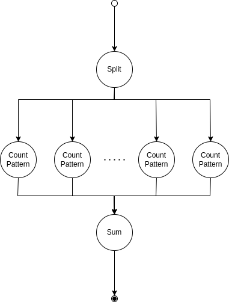
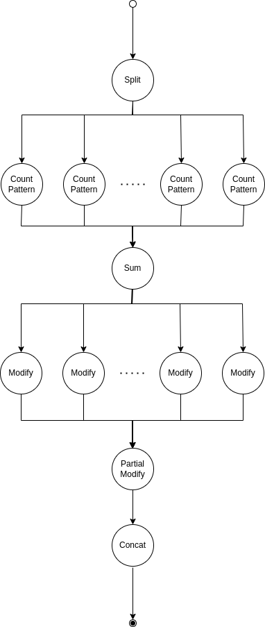

# Apollo Project Task
In this repository, we want to deploy two versions of a workflow task on the available resources. We use Docker and Apache OpenWhisk as our resources. This project is based on [Apollo Project](https://github.com/Apollo-Core/Tutorial).


## Dependency
### Apache OpenWhisk
You can use the [Apache Openwhisk documentation](https://openwhisk.apache.org) for installation and more use cases, or you can install it by the below commands.       
You will need Docker, Java and Node.js available on your machine before installation.


```bash
$ cd ./Scripts/
$ ./ApacheOpenWhisk.sh
```

After successful installation, you can use the Apache OpenWhisk in three ways.

- Using WSK-CLI tool
- Rest API
- UI

The Apache OpenWhisk provides two HTTP endpoints for users.
- UI Endpoint: [http://SERVER_ADDRESS:3232/](http://SERVER_ADDRESS:3232/)
- API Endpoint: [http://SERVER_ADDRESS:3233/api/v1/](http://SERVER_ADDRESS:3233/api/v1/)

### WSK-CLI
To install the CLI tool of Apache OpenWhisk, download the binary file of WSK-CLI from [https://s.apache.org/openwhisk-cli-download](https://s.apache.org/openwhisk-cli-download) and add the WSK script path into the PATH variable of your machine.

### FAAS-CLI
For installing FaaS-CLI, run the below command:

```bash
$ curl -sSL https://cli.openfaas.com | sudo sh
```

## Tasks
We have two versions of one workflow task. In this task, we want to search through a given text string and count the occurrences of a given string pattern in that text.

### Task1
In this task, we want to count the occurrences of a given pattern.
The below diagram shows the workflow structure for this task.

<p align="center">
  
</p>


### Task2
IIn this task, we want to count the occurrences of a given pattern and remove (total occurrence - threshold) numbers of the given pattern from the end of the given string if (total occurrence > threshold). The below diagram shows the workflow structure for this task.

<p align="center">
  
</p>

### Task3
In this part of the project, I provide a custom scheduler for the apollo project. If there are less than ten generated batches from string, then it deploys all operands on local resources; otherwise, it deploys them on Apache OpenWhisk.

## Create Resources
In this project, you can choose multiple sources for deploying your resources. This document considers local node and Apache OpenWhisk as our sources.

### Deploy on Local Node
For deploy on local node you must run the bellow command.

```bash
$ cd ./FunctionTask<TASK_NUMBER>/openfaas
$ ./build.sh
```

After successful installation, the docker images mentioned in "./FunctionTask<TASK_NUMBER>/openfaas/stack.yml" file will be created, and the typeMappings.json will be updated. You can push these docker images into your docker hub account.

### Deploy on Apache OpenWhisk
Apache OpenWhisk needs authentication, and its authentication process is different from AWS, so for integrating the Apache OpenWhisk with the provided demo application, which is provided by the Apollo project, you must create a proxy server to communicate with the Apache OpenWhisk server.

#### Create Proxy Server
Firstly you must edit the configuration values in the config.py file and fill it with valid values based on your Apache OpenWhisk server configurations. Then run these commands for running the web server:
```bash
$ python3 -m venv venv
$ source ./venv/bin/activate
$ pip install -r requirements.txt
$ export FLASK_APP="webserver"
$ flask run --host 0.0.0.0
```
#### Create Resources
To deploy on Apache OpenWhisk, you must rename wsk.config.example file into wsk.config and fill it with valid values based on your Apache OpenWhisk server configurations and your proxy server configurations. To create the resources, you must run the below command.

```bash
$ cd ./FunctionTask<TASK_NUMBER>/openwhisk
$ ./deploy.sh create
$ ./deploy.sh --mapping
```

After successful installation, the typeMappings.json file will be updated by valid values. You can push these docker images into your docker hub account.


## Run Application
For running the task on demo application you must put the generated files in previous steps into ./Application folder. For update values run below commands:

```bash
$ cd ./Application
$ cp ../Workflows/Task1.yml ./task1Input/
$ cp ../FunctionTask1/openfaas/typeMappings.json ./Task1Input/typeMappingsDocker.json
$ cp ../FunctionTask1/openwhisk/typeMappings.json ./Task1Input/typeMappingsOpenWhisk.json
$ cp ../Workflows/Task2.yml ./Task2Input/
$ cp ../FunctionTask2/openfaas/typeMappings.json ./Task2Input/typeMappingsDocker.json
$ cp ../FunctionTask2/openwhisk/typeMappings.json ./Task2Input/typeMappingsOpenWhisk.json
```
Then for running tasks, run the related launch file for each tasks which is in ./Application/launches/ path.

## Custom Scheduler
To provide this scheduler, I extend SchedulerAbstract class in the sc-core package. In that file, I overrode the chooseMappingSubset function with new logic. I extracted the word counts in the text input and divided them into the wordPerBatch count, which is provided in the input. If it is less than 10, I choose Local resources for deploying the task; otherwise, serverless deployment will be selected. The built jar package exists in the ./Scheduler folder, and the source codes are based on [https://github.com/Apollo-Core/SC-Core](https://github.com/Apollo-Core/SC-Core).

To use this scheduler, you must add the jar file to the java classpath, and after that, you can choose it in the scheduling menu in demo UI.